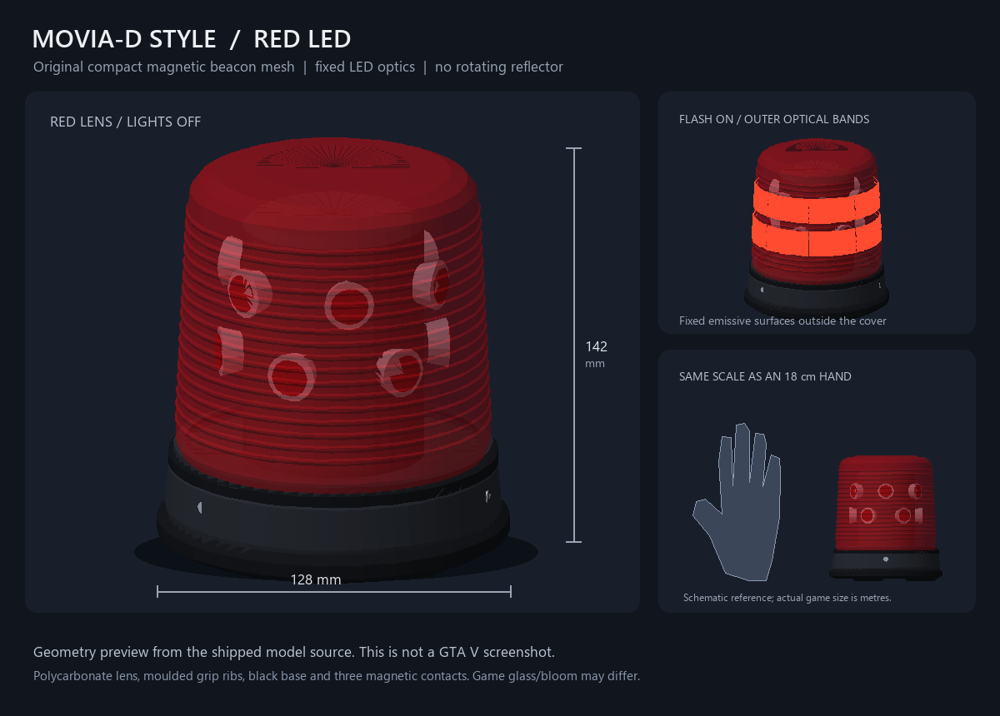

# 便携红色 LED 警灯：模型与来源

## 3.7.5 菜单位置调节

I 菜单的“便携 LED 位置”对当前启用的非紧急汽车提供左右、前后、高低三个厘米列表，每次 1 cm，范围各为 ±200 cm。调节量加在自动车顶射线落点或 `MountOffsets` 指定的落点上；主体与发光层共用新位置，附近照明的光心也随之移动。基础落点和个人偏移分开计算，重复绘制不会累加偏移；手持模型的位置不受车顶偏移影响。

设置以 `beaconOffset` 字段存入既有的逐车客户端 KVP 档案，优先按已配置的永久车辆 ID，否则按服务器地址、车型、车牌区分。不同玩家各自保存，仅影响自己的本地显示，不同步此偏移；未安装时可先保存，下次放置应用。装拆操作期间暂时禁用位置编辑，避免改变正在交接的落点。“重置 LED 位置”仅重置此偏移，警笛档案的重置也保留 LED 位置。

模型文件、闪光时序和 2 秒原生动作沿用 3.7.4。位置计算与存储会通过模拟回归验证，具体车型的贴合仍需游戏内确认。

本版按用户提供的 MOVIA-D LED 车顶警灯参考，重新制作小型红色磁吸 LED 警灯。红色灯罩、黑色底座、灯罩同心细纹、三个橡胶磁脚以及固定的 LED 光学模块均由本项目程序化建模。没有从 BMW 模组提取、修改或分发任何第三方模型、纹理或车辆文件；本版本的原创模型与生成源码适用根目录 LICENSE 中的专有许可；此前已发布版本的许可权利不受此变更影响。

原先约 24 cm 的蓝色圆顶旋转灯已经停用。新模型最大直径 **12.8 cm**、总高 **14.2 cm**，尺寸直接写入顶点坐标，单位为米，不依赖运行时缩放。这个尺寸是本项目为单手便携使用选定的建模尺寸；并非经实物扫描确认的 MOVIA-D LED 厂家尺寸。红色配色也是本项目按用户要求制作的版本，不代表厂家旧款产品认证。

| 文件 | 内容 |
| --- | --- |
| `stream/yx_movia_d_red.ydr` | 黑色磁吸底座、红色透明 PC 风格灯罩、17 道模制细纹、固定暗色 LED 与反射杯；14220 顶点、13868 三角形 |
| `stream/yx_movia_d_red_glow.ydr` | 位于外灯罩表面外侧的两圈发光光学带，固定不旋转；5328 顶点、4736 三角形；通过实体可见性开关实现闪光 |
| `stream/yx_movia_d_red_glow.ytyp` | 主体与新版发光模型两个 `ASSET_TYPE_DRAWABLE` archetype；纹理全部内嵌，无外部 YTD 依赖 |
| `tools/beacon-assets/generate.py` | 原创几何、法线、DDS、CodeWalker XML 与 OBJ 生成源码，仅依赖 Python 标准库 |
| `tools/beacon-assets/build.ps1` | 使用 CodeWalker 编译，再重新加载模型核对顶点数、尺寸与 archetype 类型 |
| `tools/beacon-assets/preview.py` | 使用 Pillow 读取生成的 OBJ 并绘制几何与手掌尺寸对照图 |

主体和发光光学带都以灯底中心为原点，Z 轴向上，两个实体安装时使用同一个位置与朝向。主体包围盒为 `[-0.064, -0.064, 0]` 到 `[0.064, 0.064, 0.142]`。两圈光学带位于局部 Z=0.062–0.084 m 与 Z=0.092–0.114 m，灯光中心仍为 Z=0.088 m。它们按灯罩细纹外形放样，比对应灯罩表面向外偏移 0.9 mm；最大半径约 57.72 mm，仍小于黑色底座的 64 mm 半径。发光实体应随主体固定，只在闪光阶段显示；灯罩及暗色光学模块始终保留。没有旋转反射器，也无需旋转光束。

早期 `yx_movia_d_red_led` 使用位于色罩内部的十二片小镜片，最大半径约 42.85 mm，发光倍率为 6；在红色玻璃和正常游戏视距下，可见发光面积很小。本版用外层光学带表现光线透过灯罩后的亮面，并将 `emissive.sps` 的 `emissiveMultiplier` 提高到 35。构建脚本重新读取实际 YDR，检查 shader、opaque render bucket 和发光倍率；生成脚本还检查发光顶点位于灯罩外侧。新模型采用不同名称避免继续请求旧发光几何。升级包不保留旧 `yx_movia_d_red_led.ydr` 和 `yx_movia_d_red.ytyp`。



这张预览来自实际生成模型的 OBJ 三角形，右上角展示新发光光学带的位置，右下角的 18 cm 手掌轮廓仅用于直观比较尺寸。它不是游戏截图，也不是动作或实机亮度测试；游戏内透明材质、环境反射与 bloom 以 GTA V 实际渲染为准。

参考来源：

- 用户截图对应的 [CSYON：Unmarked BMW F10 - Austrian Edition [ELS]](https://www.gta5-mods.com/vehicles/unmarked-bmw-f10-austrian-edition-els)。作者说明可取下 MOVIA-D LED，页面同时注明禁止转载或编辑该模组；这里只参考用户给出的外形方向，没有下载或复制模型。
- [Hänsch 原厂 MOVIA-D LED 产品资料（2012-02-06，厂家账号 fg.haensch.de 发布于 Yumpu）](https://www.yumpu.com/de/document/view/20810267/produktinformation-movia-d-led)。用于核对 MOVIA-D LED 为 LED 四连闪、三磁脚、PC 灯罩与铝制壳体，并有黑色底座/透明罩方案。旧型号外形与新版 MOVIA-SL 不混称；此处未把 MOVIA-SL 的尺寸当作 MOVIA-D 的尺寸。
- [Hänsch 当前 MOVIA-SL LED 官方产品页](https://www.fg-haensch.de/en/products/blue-light-applications/led-beacons/movia-sl/movia-sl-led.html)。只用于补充磁吸便携 LED 警灯结构的参考，未把该型号标称参数作为本模型规格。
- [Sollumz v2.7.2 Shader 定义](https://github.com/Sollumz/Sollumz/blob/v2.7.2/cwxml/Shaders.xml)。核对 `default`、`glass`、`emissive` 的参数与顶点布局：普通及发光材质采用 `Position/Normal/Colour0/TexCoord0`，玻璃额外使用 `Tangent`；发光镜片使用 `emissive.sps` 与显式 `emissiveMultiplier`。
- [CodeWalker](https://github.com/dexyfex/CodeWalker)。作为本地模型编译与二进制检查工具，工具 DLL 不随资源分发。

重建模型：在资源目录执行 `./tools/beacon-assets/build.ps1 -CodeWalkerDirectory <含 CodeWalker.Core.dll 与 SharpDX DLL 的目录>`。随后执行 `python tools/beacon-assets/preview.py` 重建预览图。`build/` 和 `reference/` 均为本地中间资料，不进入安装包；运行时只需要包内 `stream/` 文件。

已完成二进制重新加载、archetype 类型、尺寸和顶点校验，以及模型几何预览。尚未在 FiveM 实机确认材质、伸手动作或不同车型车顶贴合；特殊车型仍可通过 `beacon-config.json` 的 `MountOffsets` 调整放置点。

## 3.7.4 原生动作来源与时序

动作使用用户从 RPEmotes 提供的 **Car Taunt 3** 条目：GTA 原生字典 `missarmenian1driving_taunts@lamar_1`，片段 `hahahakeepup`。上游 [AnimationList.lua](https://raw.githubusercontent.com/alberttheprince/rpemotes-reborn/master/client/AnimationList.lua) 的 `cartauntc` 条目要求在车内使用，并指定 `EmoteDuration = 2000`。客户端直接请求游戏自带字典，运行不依赖 RPEmotes resource，也不下载或分发动画文件。

3.7.4 使用与 RPEmotes 汽车播放路径一致的参数：

```js
TaskPlayAnim(ped, 'missarmenian1driving_taunts@lamar_1', 'hahahakeepup',
    5.0, 5.0, 2000, 51, 0.0, false, false, false);
```

[Emote.lua](https://raw.githubusercontent.com/alberttheprince/rpemotes-reborn/master/client/Emote.lua) 在普通汽车内选用标记 `51`，默认混合速度 `5.0/5.0`，并传入播放参数 `0`；[Utils.lua](https://raw.githubusercontent.com/alberttheprince/rpemotes-reborn/master/client/Utils.lua) 的 `PlayAnim(...)` 直接将参数传给 `Citizen.InvokeNative(0xEA47FE3719165B94, ...)`，没有重写播放参数。该原生接口与标记定义见 [CitizenFX TASK_PLAY_ANIM](https://raw.githubusercontent.com/citizenfx/natives/master/TASK/TaskPlayAnim.md)。这里按上游调用使用 `0`，不对动画施加归一化时间控制或冻结。

客户端收到动作事件后立即开始播放并安排独立定时器。第 250 ms、650 ms 观察播放状态，其中 650 ms 检查未检测到播放的操作；这两个检查不增加动作时长。第 1000 ms 的交接先清除旧附着物，再在下一次可渲染时根据阶段重建：放置从左手改为车顶，收回从车顶改为左手。第 2000 ms 清除临时物体、停止动作，并由操作者发送完成确认；收回完成后等待服务器期间不再生成手持物体。服务端重新验证权限、驾驶位、车辆身份和控制器状态后提交结果，已安装的车顶显示由状态重建。交接与结束清理不依赖模型当帧是否可见。

每个定时回调都检查资源是否仍在运行，以及操作对象是否仍为当前对象；交接和结束前还会检查操作者所在车辆与驾驶位等条件。结束后 4000 ms 仍未收到状态确认会取消并清理，资源停止时撤销剩余定时器。取消收回会删除当次临时物体，再按服务端保留的安装状态重建车顶模型。动作启动与定时回调的异常会触发临时物体清理、游戏通知和 F8 错误日志。

创建附着关系时先调用 `DetachEntity`，再通过 `IsEntityAttachedToEntity` 核对主体与发光层的实际附着对象；未成功附着时会在后续绘制帧重试。中点交接采用删除后重建，不复用原来手上的物体句柄。主体或发光层任意一个实体丢失时，会清理并重建整组显示。

资源启动和发起新操作前会清理历史手持残留，只处理本地 `CObject` 中同时满足三项条件的实体：未联网；当前附在本地玩家角色上；模型是 `yx_portable_beacon`、`yx_portable_beacon_rotor`、`yx_movia_d_red`、`yx_movia_d_red_led` 或 `yx_movia_d_red_glow`。其他模型、其他玩家上的物体和网络物体均不在该清理范围内。

外层发光模型使用 `emissiveMultiplier = 35`。脚本默认在 800 ms 周期的 `[0,90)`、`[160,250)`、`[320,410)`、`[480,570)` ms 显示外层光学带，每次亮 90 ms；附近照明使用相同四连闪、颜色 `[255,12,12]`、范围 12 m、强度参数 3.0。`LightIntensity` 控制附近照明，模型材质倍率在 YDR 中，二者独立。OFF 档与装拆动作期间关闭发光层，主体灯罩仍可见。

3.7.1 的自定义左臂动画、IK 修正、手腕接触等待与冻结时间控制已被替代。当前安装包不包含 `stream/yx_beacon_hand.ycd` 或 `tools/beacon-animation`，完整替换升级时应去掉这些旧文件。本次参数、流程和发光几何调整针对用户反馈进行；实际动作、车型贴合与亮度仍需 FiveM 实机验收。
